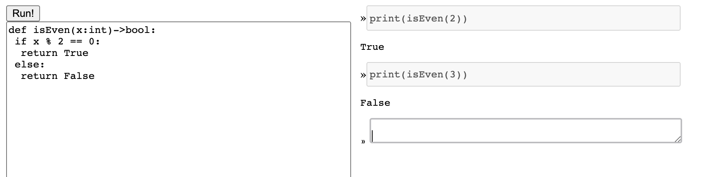
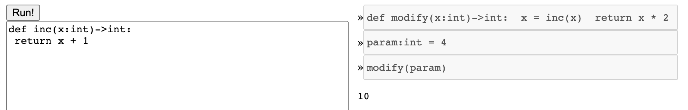
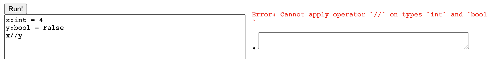
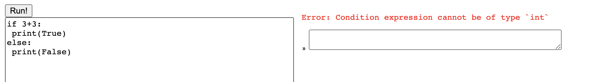
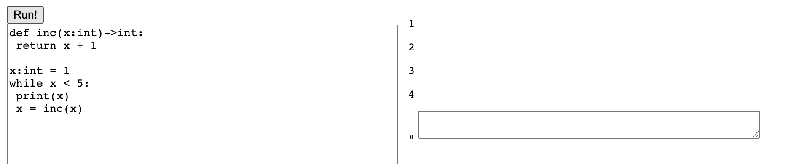
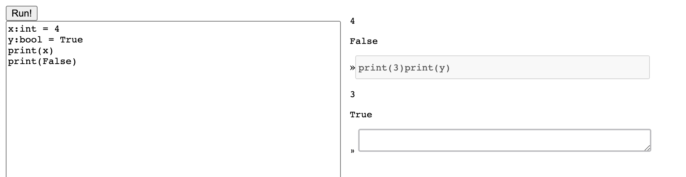
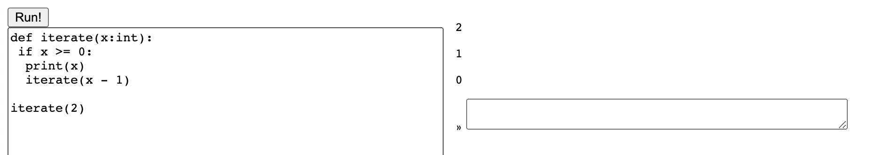
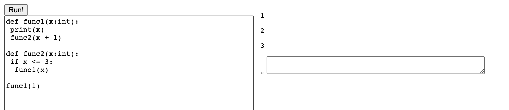

### 1. A description of the representation of values (integers, booleans, and None) in your implementation. Give examples, and explain why it is necessary to do so.
  
  Integers: in TypeScript: BigInt, in Web Assembly: i64.const. 
  
  Booleans: in TypeScript: BigInt, in Web Assembly: i64.const.
  
  None: in TypeScript: BigInt, in Web Assembly: i64.const.
  
  I use 64 bits to distinguish the types. In the high-32 bits, I use it as a tag to indicate type. 0 means Integers, 1 means Booleans. 
  
  In the low-32 bits part, for Booleans, 1 means TRUE, 0 means FALSE, while for Integers, I use the literal 32 bits to represent.
  
  For example, integer 2 is 0x0000 0x0000 0x0000 0x0011 in hex. Boolean True is  0x0000 0x0001 0x0000 0x0001 in hex, 4294967297 in decimal. 
  
  Since NONE cannot be either in the main body or print/assign, I don't tag it using high-32 bits right now. In this PA, it is only valid when it is in the binary operation "NONE is NONE". But if I need to tag this, for example if later we have Object, I could use the high-32 bits to tag this type.
  
  The reason for this representation is that I need to find a way to tell print() whether the valued i64.const passed in is an Integer or Boolean. In this tagging way, it can tell from the high-32 bits whether it is an integer or a boolean, then print the corresponding value. I could not use the last few bits to tag the types because bit manipulation in JS only happens on the low-32 bits even it uses 64 bits to represent numbers, which means integers who has 1 on the 32nd bit (in which case uses 33 bits, 32 + 1 tag), will lose 1 bit on the high end. One thing to mention is about how to represent something like the "3 == 4" binop. The code snippet is [here](https://github.com/FrancisBian/pa2-cse231/blob/7388af0c7f835be0543a323672f6c774d447c58c/compiler.ts#L398). I need to first use ```(i64.eq)``` to get an i32 result, then extend to i64 using ```(i64.extend_s/i32)``` for integer size consistency, and then ```(i32.add)``` to 0x0000 0x0001 0x0000 0x0000 to represent the entire operation as a boolean-tagged i64 value.
  
  

### 2. Give an example of a program that uses
* At least one global variable
* At least one function with a parameter
* At least one variable defined inside a function

### By linking to specific definitions and code in your implementation, describe where and how those three variables are stored and represented throughout compilation.

The code is 
```
x:int = 1

def f(x:int):
 y:int = 2
 print(x)

f(100)
```

And the result is
```
100
```

After parsing in parser.ts [here](https://github.com/FrancisBian/pa2-cse231/blob/7388af0c7f835be0543a323672f6c774d447c58c/parser.ts#L77), the first line ```x:int = 1``` becomes of type with tag "init", name "x", type "Type.int" enum, and value 1. Then it passes [Type Checking](https://github.com/FrancisBian/pa2-cse231/blob/7388af0c7f835be0543a323672f6c774d447c58c/compiler.ts#L159) to check type declaration, duplication and integer range. After all statements pass Type Checking, the [globalEnv](https://github.com/FrancisBian/pa2-cse231/blob/7388af0c7f835be0543a323672f6c774d447c58c/compiler.ts#L8) will get updated. In short, it will save offset for the newly declared global variable and update global functions. Last, I use the related [codeGen](https://github.com/FrancisBian/pa2-cse231/blob/7388af0c7f835be0543a323672f6c774d447c58c/compiler.ts#L283-L289) to generate the wasm code. One thing to note is that, if I declare a variable which shares the same name with a global variable in a function, or the param variable shares the same name, I will use [a copy of the original environment excluding the name-duplicated variable](https://github.com/FrancisBian/pa2-cse231/blob/7388af0c7f835be0543a323672f6c774d447c58c/compiler.ts#L314-L316) and then pass it to generate statements for the function definition block. The reason for this is to use ```local.set``` or ```local.get``` to handle local variables in functions.

We can jump to the function definition in detail. As I said, when I generate the code for the body statements of the function, the environment passed in is the modified copy of the original environment, with shared name variables removed from global variables. Thus, for ```y:int = 2```, it will first declare ```local $y i64``` at the top level of the function, then use this ["init"](https://github.com/FrancisBian/pa2-cse231/blob/7388af0c7f835be0543a323672f6c774d447c58c/compiler.ts#L308) to assign value. Since ```x``` is removed from the local environment, ```print(x)``` will get ```local.get $x``` instead of load the value of the global ```x```. 

Last, for the Call Statement ```f(100)```, ```i64.const 1000``` will be first pushed the stack, can then function will be called. When we execute ```print(x)``` in the function, it will popped the value on the stack generated by ```local.get $x```.


### 3.Write a Python program that goes into an infinite loop. What happens when you run it on the web page using your compiler?

The code I write is 
```
while True:
 print(1)
```
This code block will keep printing 1 when I use the python program, while freeze the webpage when I run it using my compiler. That is because this program goes into an infinite loop. It does not end up finishing executed. So "REPL.ts" is still [awaiting the result](https://github.com/FrancisBian/pa2-cse231/blob/7388af0c7f835be0543a323672f6c774d447c58c/repl.ts#L33) so that it can render it as the html. That's why the page shows nothing and freezes.


### 4.For each of the following scenarios, show a screenshot of your compiler running the scenario. If your compiler cannot handle the described scenario, write a few sentences about why.
* A function defined in the main program and later called from the interactive prompt


* A function defined at the interactive prompt, whose body contains a call to a function from the main program, called at a later interactive prompt


* A program that has a type error because of a mismatch of booleans and integers on one of the arithmetic operations


* A program that has a type error in a conditional position


* A program that calls a function from within a loop


* Printing an integer and a boolean


* A recursive function.


* Two mutually-recursive functions.


